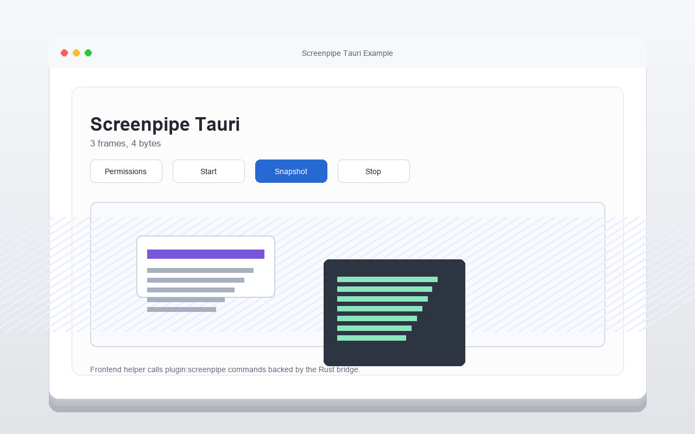

# Screenpipe Tauri Example



Back to the [examples index](../README.md).

This is a minimal Tauri v2 app using the SDK's Tauri frontend client and Rust
plugin.

```bash
cd examples/tauri-app
npm install
npm run dev
```

The Rust plugin starts the shared `bridges/node-json-session.mjs` process and
points it at this repo as `SCREENPIPE_SDK_ROOT`.
